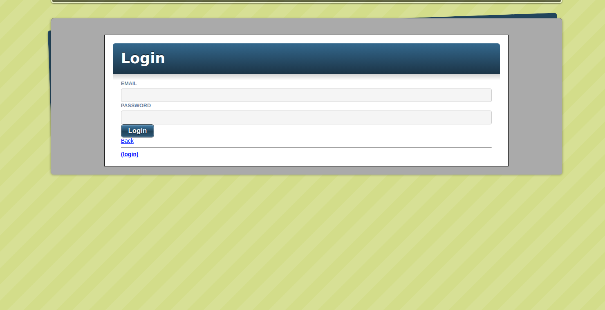

# Build A Blog Website with Ruby on Rails

> The aim of this project is to learn and get comfortale with Ruby on Rails by building a simple blog website that used all CRUD methods using  [the Jumpstart Lab’s Blogger Tutorial](http://tutorials.jumpstartlab.com/projects/blogger.html) 

## Project screenshot

## Project specifications
1. Do the Jumpstart Lab’s Blogger Tutorial sections I0 through I4.
2. Pay attention to any error messages. it’s helpful to start getting familiar with which portions of the message you should pay attention to (and maybe put into Google if you can’t figure out what caused it).
3. deploy your app to Heroku!

## 🔨 Built in

- Ruby On Rails

## 🚀 Our Project

Our project can be found at 
## Live Demo

- run rspec ./spec/enum_spec.rb

## 👨🏽‍💻 👨🏿‍💻 Creators

👤 **Author1**

- Github: [Jorge Torres](https://github.com/Yors-git)
- Linkedin: [Jorge Torres](https://www.linkedin.com/in/jtbribiesca/)

👤 **Author2**

- Github: [Gilbert Gotora](https://github.com/ggotora)

## 🤝 Contributing

Contributions, issues and feature requests are welcome!

Feel free to check the [issues page](https://github.com/Yors-git/blog_ror_app/issues).

## Show your support

Give a ⭐️ if you like this project!

## 📝 License

This project is [MIT](LICENSE) licensed.
